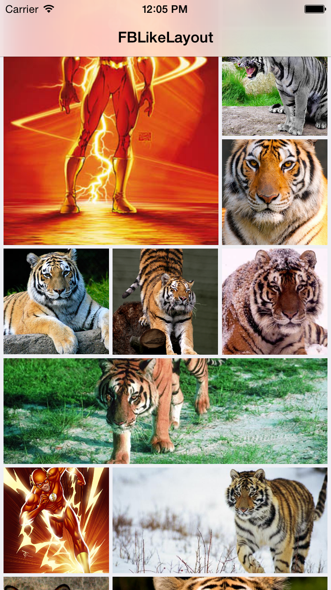
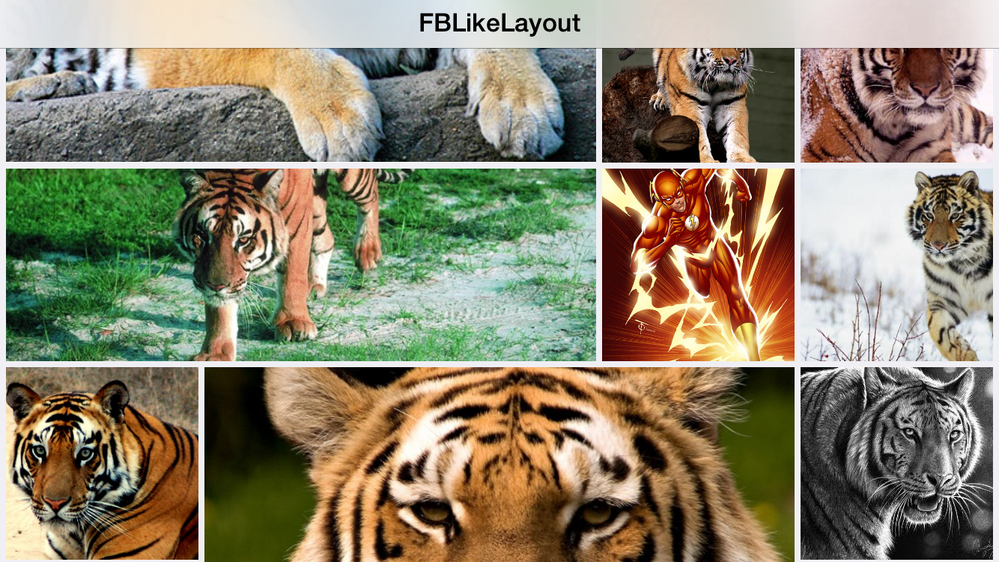

FBLikeLayout
=============

This is an UICollectionView layout inspired by the photo section of facebook.
This layout loads squared items with randomic full size items.
It works with standard layout delegate methods. No additional custom methods to be implemented.

 



##FBLikeLayout
You can use this layout in your project by adding to your podfile:
<pre>pod 'FBLikeLayout'</pre>

##Usage

Just allocate a new `FBLikeLayout`, then customize the few properties this layout comes with

```objc
FBLikeLayout *layout = [FBLikeLayout new];

//in this case we want 3 cells per row, maximum. This is also the default value if you do not customize the layout.singleCellWidth property 
CGFLoat cellWidth = (MIN(self.collectionView.bounds.size.width, self.collectionView.bounds.size.height)-self.collectionView.contentInset.left-self.collectionView.contentInset.right-8)/3.0;

layout.minimumInteritemSpacing = 4;
layout.singleCellWidth = cellWidth;
layout.maxCellSpace = 3; //for full size cells, this parameter determines the max cell space

//if you want the items size to be forced in order to have the minimumInteritemSpacing always respected. Otherwise the interitem spacing will be adapted in order to cover the complete row with cells
layout.forceCellWidthForMinimumInteritemSpacing = YES;
layout.fullImagePercentageOfOccurrency = 25; //this percent value determines how many times randomly the item will be full size.

self.collectionView.collectionViewLayout = layout;
```

Then just implement the UICollectionViewDelegateFlowLayout method:
```objc
-(CGSize) collectionView:(UICollectionView *)collectionView layout:(UICollectionViewLayout *)collectionViewLayout sizeForItemAtIndexPath:(NSIndexPath *)indexPath
```